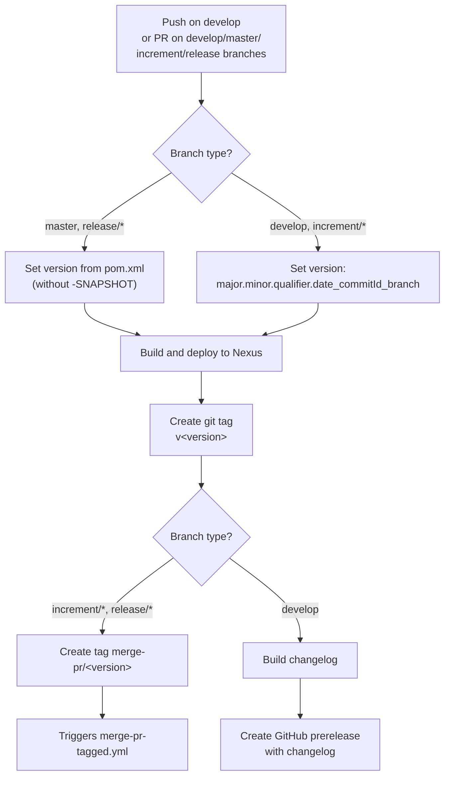
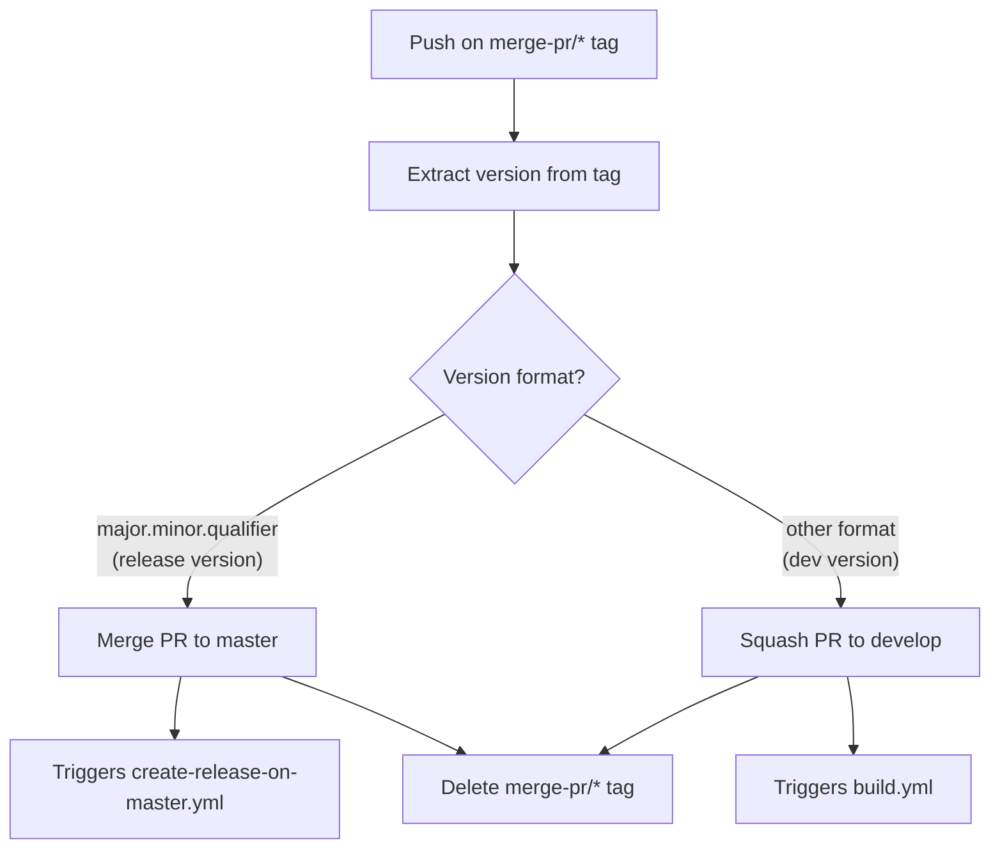
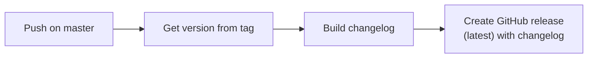
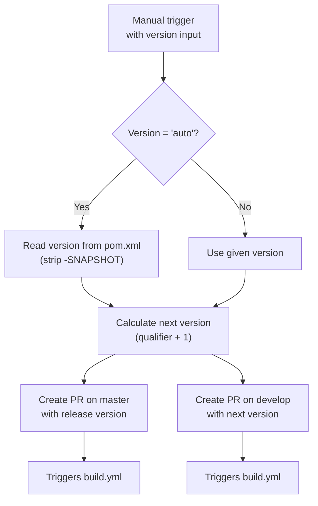
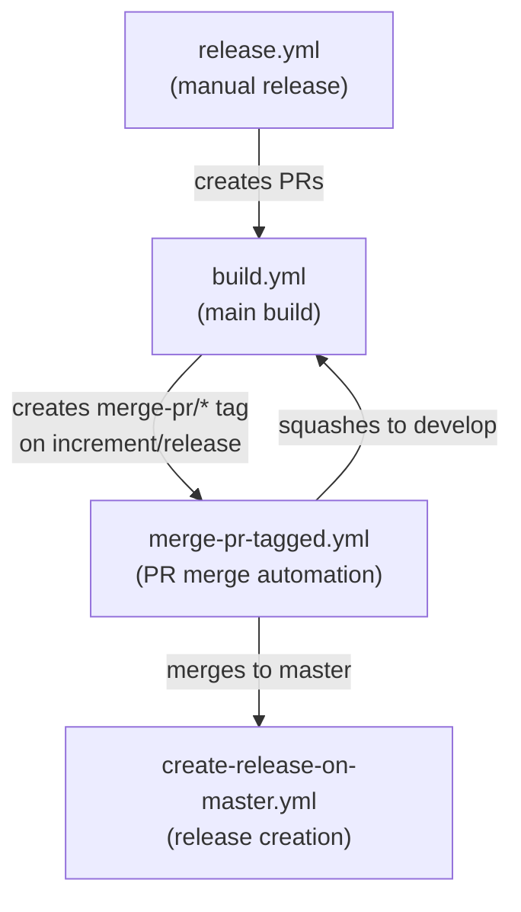

# Development Version and Branch Handling

This document describes the branching strategy, versioning policy, and CI/CD automation for JUDO-NG modules.

## Branches

The versioning policy follows [GitFlow](https://www.atlassian.com/git/tutorials/comparing-workflows/gitflow-workflow). Each branch type serves a specific purpose in the development lifecycle:

| Branch Pattern | Base | Purpose |
|----------------|------|---------|
| `develop` | — | Main development branch; contains latest development sources |
| `feature/JNG-xxx_summary` | `develop` | New features for the next release |
| `(release/)X.Y.Z` | `develop` | Stabilization branch for a specific release (`release/` prefix reserved for CI) |
| `bugfix/JNG-xxx_summary` | release branch | Bug fixes applied during release testing |
| `support/JNG-xxx_summary` | release branch | Minor changes for a previous release |
| `hotfix/JNG-xxx_summary` | `master` | Critical fixes applied to both master and develop |
| `master` | — | Latest released sources |

### Branch Flow

The following diagram shows how branches interact across the full development lifecycle, from feature development through release and hotfix:

```mermaid
gitGraph
    commit id: "init"
    branch develop order: 1
    checkout develop
    commit id: "dev-start"

    branch feature/JNG-1 order: 2
    commit id: "feat-1a"
    commit id: "feat-1b"
    checkout develop
    merge feature/JNG-1 id: "merge-feat-1"

    branch feature/JNG-2 order: 3
    commit id: "feat-2a"
    checkout develop
    merge feature/JNG-2 id: "merge-feat-2"

    branch release/1.0-beta1 order: 4
    commit id: "rc-1"

    branch bugfix/JNG-4 order: 5
    commit id: "bugfix-4"
    checkout release/1.0-beta1
    merge bugfix/JNG-4 id: "merge-bugfix"
    checkout develop
    merge release/1.0-beta1 id: "merge-release-to-dev"

    checkout master
    merge release/1.0-beta1 id: "release-1.0" tag: "v1.0"

    checkout develop
    commit id: "dev-continues"
```

## Version Numbers

Version numbers follow semantic versioning with these rules:

| Event | Version Change |
|-------|---------------|
| Start a `feature/` branch | No version change |
| Start a `release/` branch | 2nd number incremented on `develop` |
| Start a `bugfix/` branch | No version change (applied on release branches during testing) |
| Start a `support/` branch | 3rd number incremented (minor changes for a previous release) |
| Start a `hotfix/` branch | 4th number incremented (applied to both release and master) |

## GitHub Actions Workflows

The CI/CD pipeline is automated through several interconnected GitHub Actions workflows.

### build.yml — Main Build Pipeline

Triggers on push to `develop` or pull requests targeting `develop`, `master`, `increment/*`, or `release/*` branches.



### merge-pr-tagged.yml — PR Merge Automation

Triggers when a `merge-pr/*` tag is pushed. Routes PRs to the correct target branch based on version format:



### create-release-on-master.yml — Release Creation

Triggers on push to `master`. Builds a changelog and creates a final GitHub release:



### release.yml — Manual Release

Manually triggered with a version parameter (either `'auto'` to read from pom.xml, or an explicit `major.minor.qualifier`):



### Workflow Interaction Overview



## How to Develop

For issue tracking we use [JIRA](https://blackbelt.atlassian.net/jira/dashboards).

> **Important:** There is no commit without a ticket number. Every pull request and commit must include a `JNG-xxx` reference.
