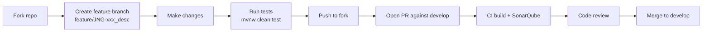

# Contributing to JUDO

Thank you for your interest in contributing to the JUDO Dispatcher API! This guide covers everything you need to get started.

## Development Environment

### Prerequisites

| Requirement | Version | Notes |
|-------------|---------|-------|
| Java JDK | 21 | Required for compilation and tests |
| Maven | 3.9.4+ | Or use the included `./mvnw` wrapper |

For full environment requirements, see the parent project's [contributing guide](https://github.com/BlackBeltTechnology/judo-community/blob/develop/CONTRIBUTING.adoc).

## Code Structure

This is a single-module Maven project that produces an OSGi bundle:

```
src/
├── main/java/hu/blackbelt/judo/dispatcher/api/   # Public API interfaces and classes
└── test/java/                                     # JUnit 5 tests
```

All source lives in the `hu.blackbelt.judo.dispatcher.api` package. This is a pure API library — it defines interfaces and lightweight model classes only. There is no implementation code here.

## Build Commands

```bash
# Run tests
./mvnw clean test

# Full build (compile, test, install to local repo)
./mvnw clean install
```

## Submitting an Issue

Before opening a new issue, search the [issue tracker](https://github.com/BlackBeltTechnology/judo-dispatcher-api/issues) — your problem may already be reported or resolved.

To help us reproduce and fix issues quickly, please include:

- Output of `java -version` and `mvn -version`
- `pom.xml` or `.flattened-pom.xml` (when applicable)
- A minimal reproduction case that demonstrates the failure

> **Note:** We require a minimal reproduction for all bug reports. This lets us confirm the bug and ensure we fix the right problem. We understand extracting minimal code from a larger codebase can be difficult, but isolating the problem is essential before we can fix it.

File new issues using the [issue form](https://github.com/BlackBeltTechnology/judo-dispatcher-api/issues/new/choose).

## Submitting a Pull Request

This project uses [GitHub's standard forking model](https://guides.github.com/activities/forking/). Fork the repository, make your changes on a feature branch, and submit a pull request.

### Branch Naming

All branches must reference a JIRA ticket:

- Feature: `feature/JNG-xxx_short_description`
- Bugfix: `bugfix/JNG-xxx_short_description`
- Support: `support/JNG-xxx_short_description`

> **Important:** There is no commit without a ticket number. Every commit and pull request must include a `JNG-xxx` reference.

### PR Workflow


