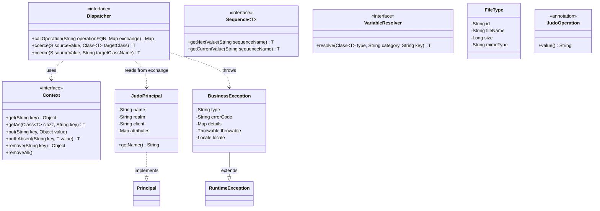
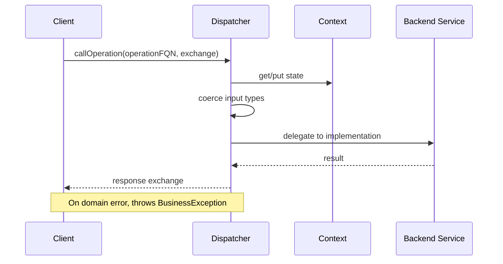
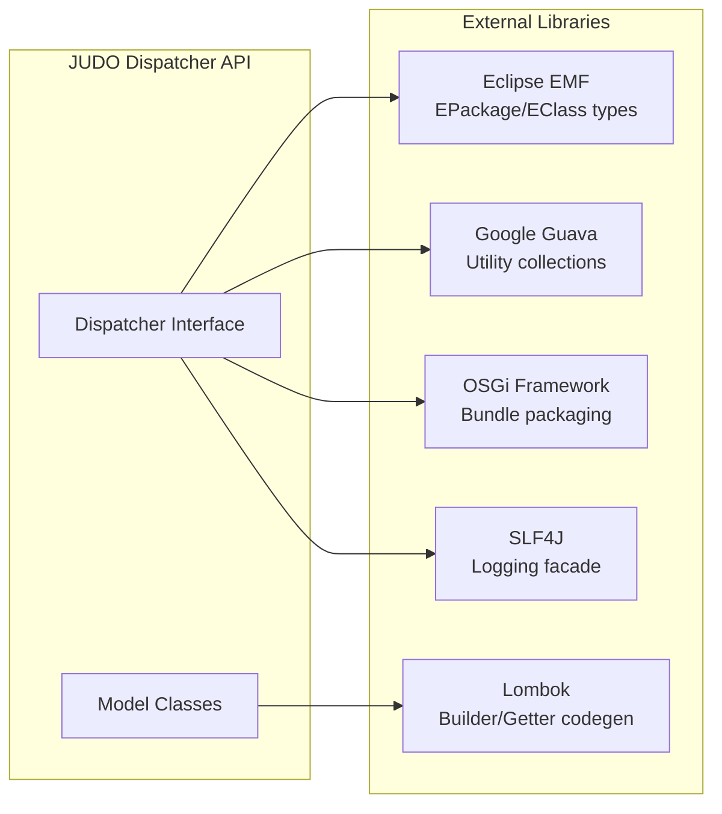
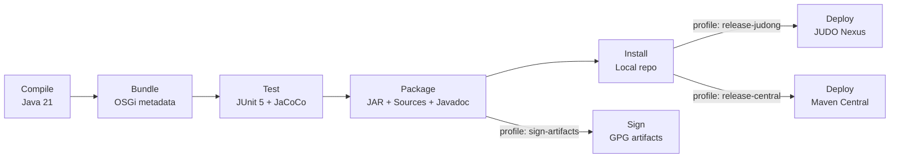

# judo-dispatcher-api

[](https://github.com/BlackBeltTechnology/judo-dispatcher-api/actions/workflows/build.yml)

## Introduction

The Dispatcher API defines the core contracts for routing incoming API calls to the appropriate action in the JUDO-NG platform. Actions can be recursive Dispatcher calls (for nested payloads) or direct database calls. The Dispatcher also handles mapping and validation of inputs before forwarding them.

This is a **pure API library** — it contains only interfaces, annotations, and lightweight model classes with no implementation code. Implementations live in other JUDO-NG modules that depend on this API.

## API Overview

All types live in the `hu.blackbelt.judo.dispatcher.api` package:



| Type | Kind | Purpose |
|------|------|---------|
| `Dispatcher` | Interface | Routes API calls to operations; performs type coercion |
| `Context` | Interface | Thread-safe key-value store for passing state through dispatch chains |
| `Sequence<T>` | Interface | Generates sequential values (counters, IDs) by name |
| `VariableResolver` | Interface | Resolves environment/category variables at runtime |
| `JudoPrincipal` | Class | Security principal carrying user name, realm, client, and attributes |
| `BusinessException` | Class | Domain exception with type, error code, details map, and locale |
| `FileType` | Class | File metadata container (ID, filename, size, MIME type) |
| `JudoOperation` | Annotation | Marks methods as Dispatcher operations (runtime-retained) |

### Dispatcher Exchange Model

The `Dispatcher.callOperation()` method uses a `Map<String, Object>` exchange for both request and response. The exchange carries well-known keys as constants on the `Dispatcher` interface:

| Key | Constant | Description |
|-----|----------|-------------|
| `__this` | `INSTANCE_KEY_OF_BOUND_OPERATION` | Mapped transfer object for bound operations |
| `__entityType` | `ENTITY_TYPE_MAP_KEY` | Entity type discriminator |
| `__principal` | `PRINCIPAL_KEY` | Security principal (`JudoPrincipal`) |
| `__actor` | `ACTOR_KEY` | Actor reference |
| `__variables` | `VARIABLES_KEY` | Resolved variables |
| `__headers` | `HEADERS_KEY` | HTTP headers |

### Runtime Flow



## External Dependencies



## Building

This project uses Maven with the Maven Wrapper for reproducible builds:

```bash
# Run tests
./mvnw clean test

# Full build and install to local repository
./mvnw clean install

# Run a single test class
./mvnw test -Dtest=MyTestClass

# Run a single test method
./mvnw test -Dtest=MyTestClass#myMethod
```

> **Note:** Requires Java 21 JDK. The Maven Wrapper (`./mvnw`) ensures the correct Maven 3.9.4 version is used automatically.

### Build Lifecycle



### Maven Profiles

| Profile | Purpose |
|---------|---------|
| `sign-artifacts` | GPG-signs build artifacts for release |
| `release-dummy` | Deploys to local `/tmp/` directory for testing |
| `release-judong` | Deploys to JUDO-NG Nexus snapshot repository |
| `release-central` | Deploys to Maven Central via Sonatype OSSRH |
| `generate-github-asciidoc-diagrams` | Renders AsciiDoc diagrams to PNG for GitHub |
| `update-source-code-license` | Updates EPL 2.0 license headers in source files |

## Context

This project is a building block of the [judo-community](https://github.com/BlackBeltTechnology/judo-community) aggregator project. Check the corresponding documentation there for how this module fits into the broader JUDO-NG ecosystem.

## Contributing

See [CONTRIBUTING.md](CONTRIBUTING.md) for details on submitting issues and pull requests.

## License

This project is licensed under the [Eclipse Public License - v 2.0](https://www.eclipse.org/legal/epl-2.0/).
